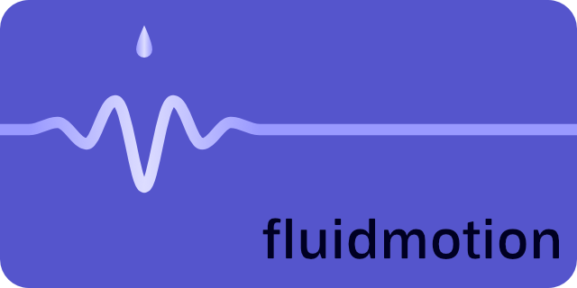

Edenator is a browser-based music visualizer implemented in React and three.js.

- [Try it out](https://radioprotector.github.io/edenator/)
- [View the source](https://github.com/radioprotector/edenator)

hex-grid is a browser-based color and audio hexagonal-grid scroller implemented in React.

- [Try it out](https://radioprotector.github.io/hex-grid/)
- [View the source](https://github.com/radioprotector/hex-grid)

fluidmotion is a browser-based wave pool simulator implemented in React and three.js.

- [Try it out](https://radioprotector.github.io/fluidmotion/)
- [View the source](https://github.com/radioprotector/fluidmotion)
